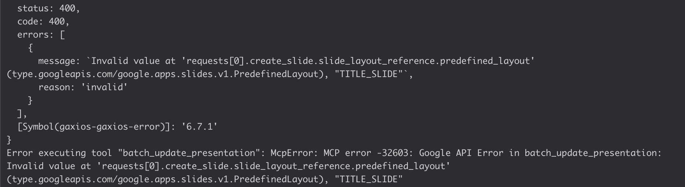
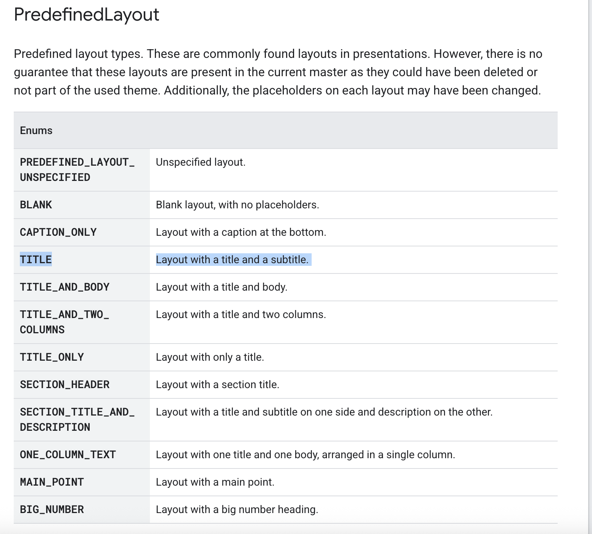

# Multi-Agent System Presentation

## Objective

Create a multi-agent system Proof-of-Concept (POC) that can:
- take in a coding-related task description
- break down the task into sub-tasks
- come up with creative implementation/solution
- delegate sub-tasks to appropriate agents
    - perform coding in a sandboxed environment
    - create a presentation to explain the code/solution
    - create a voiceover to accompany the presentation
- package deliverables 

We chose to use coding project assignments to demonstrate this POC because:
- assignment descriptions are available 

This POC is a CLI program to keep things simple.

## Development Process

The LLMs used are:
- OpenAI 4o
- OpenAI 4.1-nano
- OpenAI 4o-mini

Ollama models used for development but not "production".

### VERSION 1

First, we focus on developing the individual agents:

1. Coding Agent                                                 
    - Launch Docker environment       
    - Write code based on project description
    - Upload to GitHub repository via [Github MCP Server](https://github.com/github/github-mcp-server)

2. Presentation Agent 
    - Read code from GitHub repository
    - Generate presentation and slides via [Google Slides MCP Server](https://github.com/matteoantoci/google-slides-mcp)

3. Voiceover Agent
    - Read code & slides
    - Generate script
    - Generate audio file via [ElevenLabs MCP Server](https://github.com/elevenlabs/elevenlabs-mcp)

4. Documentation Agent (optional)
    - Specifically designed to generate documentation from generated code output     

We then follow the [LlamaIndex Multi-Agent example](https://docs.llamaindex.ai/en/stable/understanding/agent/multi_agent/) to combine the agents together in a workflow.

This results in **VERSION 1** of the POC.

#### What We Found

- rigid architecture; flow is too structured

#### Demonstration

- `orchestrator_merged.py` + `/sandbox`
- [Github Repository](https://github.com/robot-coder?tab=repositories)
- [Google Slides](https://drive.google.com/drive/home)

### VERSION 2

Tried to use Autogen. The idea was that a group chat would allow the presentation agent to gather thoughts/ideas from the other agents that they would use in the presentation.
Also this would allow the agents to be more "creative" and not have to follow the more rigid structure/workflow from version 1.

#### What We Found

- rigid architecture might be necessary for predictability/reliability
- Autogen architecture (or just any multiagent system) can quickly get overwhelming and difficult to manage
- Really difficult to mix round robin chat with other types
- It seemed like the only time it worked was the agent basically eventually learned the APIs on their own
  

## Challenges and Lessons Learned
1. Unofficial MCP servers may not work as well; we could edit the MCP server itself to make this work
    - Google Slides MCP Server unable to create Title Slide
    
    
2. Rate limiting
3. Bad documentation for a lot of MCP things and Autogen (two different versions)

4. Seems to require human/subjective evaluation - can't really see any kind of automated benchmarks helping

5. What is the value of multi-agent system at this scale?
    - is it better to have 1 agent with a variety of function-calling/tool-use capabilities or separate into different agents?

6. Prompt Engineering remains a challenge

7. [Berkeley Function Calling Leaderboard](https://gorilla.cs.berkeley.edu/leaderboard.html)

## Next Steps
- Try to look into combining sequential agents with round robin

## Personal Takeaways on Generative AI Class as a whole
Lawrence:
- Coding assistants are a game changer for better and for worse
    - quick iterations and MVPs are easy to churn out
    - effort into prompt = better quality of code?
    - may still struggle with particular codebases or integrations 
    - money vs time
- We've mostly touched on LLMs, but Voice AI is quickly becoming the next hot topic